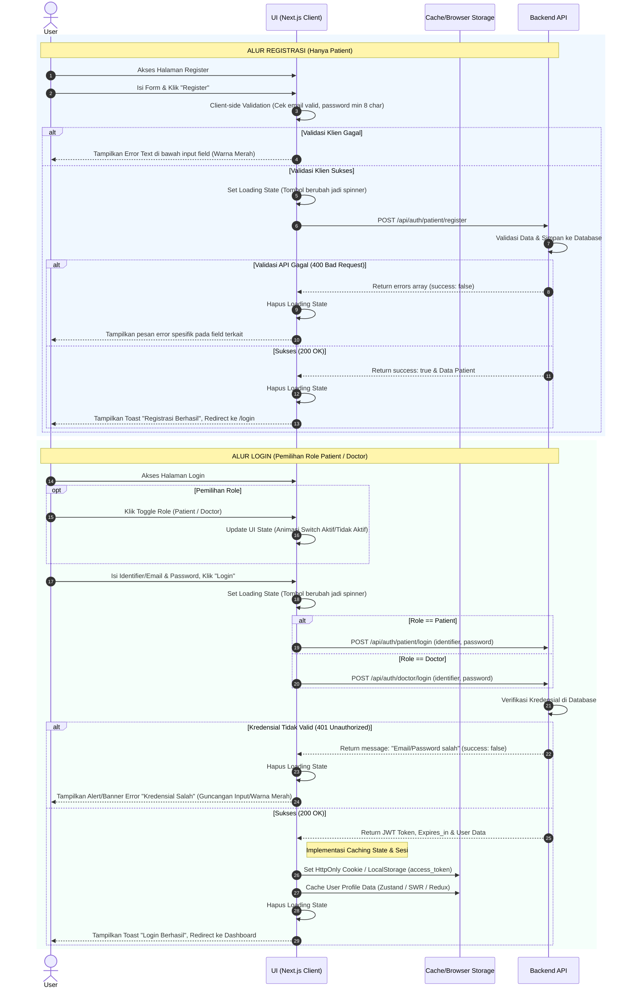

```mermaid
sequenceDiagram
    autonumber
    actor U as User
    participant UI as UI (Next.js Client)
    participant C as Cache/Browser Storage
    participant API as Backend API

    %% --- PROSES REGISTRASI (PATIENT) ---
    rect rgb(240, 248, 255)
    Note over U, API: ALUR REGISTRASI (Hanya Patient)
    
    U->>UI: Akses Halaman Register
    U->>UI: Isi Form & Klik "Register"
    UI->>UI: Client-side Validation (Cek email valid, password min 8 char)
    
    alt Validasi Klien Gagal
        UI-->>U: Tampilkan Error Text di bawah input field (Warna Merah)
    else Validasi Klien Sukses
        UI->>UI: Set Loading State (Tombol berubah jadi spinner)
        UI->>API: POST /api/auth/patient/register
        API->>API: Validasi Data & Simpan ke Database
        
        alt Validasi API Gagal (400 Bad Request)
            API-->>UI: Return errors array (success: false)
            UI->>UI: Hapus Loading State
            UI-->>U: Tampilkan pesan error spesifik pada field terkait
        else Sukses (200 OK)
            API-->>UI: Return success: true & Data Patient
            UI->>UI: Hapus Loading State
            UI-->>U: Tampilkan Toast "Registrasi Berhasil", Redirect ke /login
        end
    end
    end

    %% --- PROSES LOGIN ---
    rect rgb(245, 255, 250)
    Note over U, API: ALUR LOGIN (Pemilihan Role Patient / Doctor)
    
    U->>UI: Akses Halaman Login
    
    opt Pemilihan Role
        U->>UI: Klik Toggle Role (Patient / Doctor)
        UI->>UI: Update UI State (Animasi Switch Aktif/Tidak Aktif)
    end
    
    U->>UI: Isi Identifier/Email & Password, Klik "Login"
    UI->>UI: Set Loading State (Tombol berubah jadi spinner)

    alt Role == Patient
        UI->>API: POST /api/auth/patient/login (identifier, password)
    else Role == Doctor
        UI->>API: POST /api/auth/doctor/login (identifier, password)
    end

    API->>API: Verifikasi Kredensial di Database
    
    alt Kredensial Tidak Valid (401 Unauthorized)
        API-->>UI: Return message: "Email/Password salah" (success: false)
        UI->>UI: Hapus Loading State
        UI-->>U: Tampilkan Alert/Banner Error "Kredensial Salah" (Guncangan Input/Warna Merah)
    else Sukses (200 OK)
        API-->>UI: Return JWT Token, Expires_in & User Data
        
        Note right of UI: Implementasi Caching State & Sesi
        UI->>C: Set HttpOnly Cookie / LocalStorage (access_token)
        UI->>C: Cache User Profile Data (Zustand / SWR / Redux)
        
        UI->>UI: Hapus Loading State
        UI-->>U: Tampilkan Toast "Login Berhasil", Redirect ke Dashboard
    end
    end
```