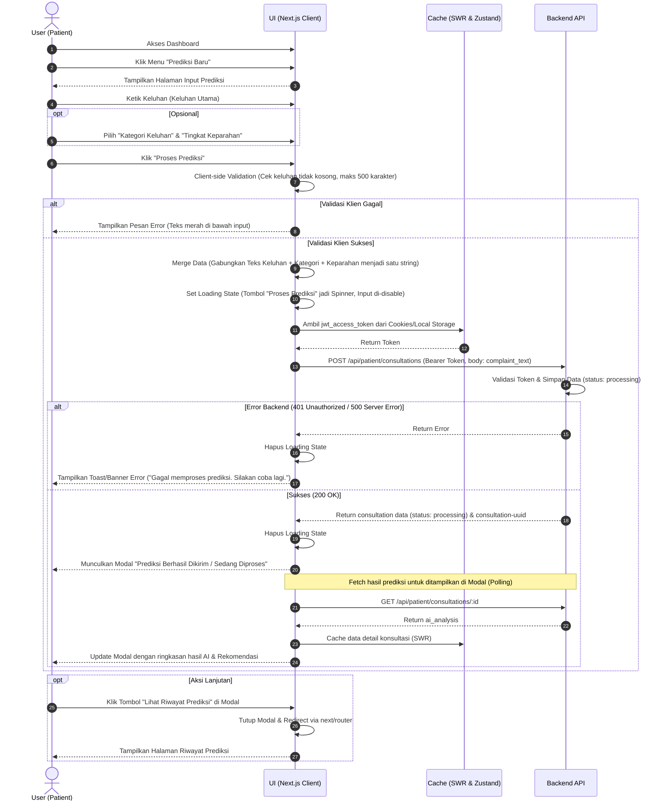

```mermaid
sequenceDiagram
    autonumber
    actor U as User (Patient)
    participant UI as UI (Next.js Client)
    participant C as Cache (SWR & Zustand)
    participant API as Backend API

    %% --- START: DASHBOARD ---
    U->>UI: Akses Dashboard
    U->>UI: Klik Menu "Prediksi Baru"
    UI-->>U: Tampilkan Halaman Input Prediksi

    %% --- INPUT & SUBMISSION ---
    U->>UI: Ketik Keluhan (Keluhan Utama)
    opt Opsional
        U->>UI: Pilih "Kategori Keluhan" & "Tingkat Keparahan"
    end
    U->>UI: Klik "Proses Prediksi"

    %% --- CLIENT VALIDATION & DATA PREP ---
    UI->>UI: Client-side Validation (Cek keluhan tidak kosong, maks 500 karakter)
    
    alt Validasi Klien Gagal
        UI-->>U: Tampilkan Pesan Error (Teks merah di bawah input)
    else Validasi Klien Sukses
        UI->>UI: Merge Data (Gabungkan Teks Keluhan + Kategori + Keparahan menjadi satu string)
        UI->>UI: Set Loading State (Tombol "Proses Prediksi" jadi Spinner, Input di-disable)
        UI->>C: Ambil jwt_access_token dari Cookies/Local Storage
        C-->>UI: Return Token

        %% --- POST REQUEST ---
        UI->>API: POST /api/patient/consultations (Bearer Token, body: complaint_text)
        API->>API: Validasi Token & Simpan Data (status: processing)
        
        alt Error Backend (401 Unauthorized / 500 Server Error)
            API-->>UI: Return Error
            UI->>UI: Hapus Loading State
            UI-->>U: Tampilkan Toast/Banner Error ("Gagal memproses prediksi. Silakan coba lagi.")
        else Sukses (200 OK)
            API-->>UI: Return consultation data (status: processing) & consultation-uuid
            UI->>UI: Hapus Loading State
            UI-->>U: Munculkan Modal "Prediksi Berhasil Dikirim / Sedang Diproses"

            %% --- FETCHING RESULT (GET REQUEST) ---
            Note over UI, API: Fetch hasil prediksi untuk ditampilkan di Modal (Polling)
            UI->>API: GET /api/patient/consultations/:id
            API-->>UI: Return ai_analysis
            
            UI->>C: Cache data detail konsultasi (SWR)
            UI-->>U: Update Modal dengan ringkasan hasil AI & Rekomendasi
        end
    end

    %% --- NAVIGASI KE RIWAYAT ---
    opt Aksi Lanjutan
        U->>UI: Klik Tombol "Lihat Riwayat Prediksi" di Modal
        UI->>UI: Tutup Modal & Redirect via next/router
        UI-->>U: Tampilkan Halaman Riwayat Prediksi
    end
```