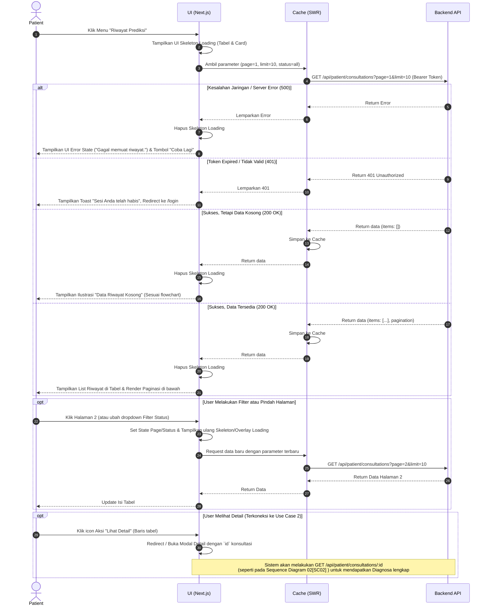

```mermaid
sequenceDiagram
    autonumber
    actor P as Patient
    participant UI as UI (Next.js)
    participant C as Cache (SWR)
    participant API as Backend API

    P->>UI: Klik Menu "Riwayat Prediksi"
    UI->>UI: Tampilkan UI Skeleton Loading (Tabel & Card)
    
    %% DATA FETCHING WITH CACHING
    UI->>C: Ambil parameter (page=1, limit=10, status=all)
    C->>API: GET /api/patient/consultations?page=1&limit=10 (Bearer Token)
    
    alt Kesalahan Jaringan / Server Error (500)
        API-->>C: Return Error
        C-->>UI: Lemparkan Error
        UI->>UI: Hapus Skeleton Loading
        UI-->>P: Tampilkan UI Error State ("Gagal memuat riwayat.") & Tombol "Coba Lagi"
        
    else Token Expired / Tidak Valid (401)
        API-->>C: Return 401 Unauthorized
        C-->>UI: Lemparkan 401
        UI-->>P: Tampilkan Toast "Sesi Anda telah habis", Redirect ke /login
        
    else Sukses, Tetapi Data Kosong (200 OK)
        API-->>C: Return data (items: [])
        C->>C: Simpan ke Cache
        C-->>UI: Return data
        UI->>UI: Hapus Skeleton Loading
        UI-->>P: Tampilkan Ilustrasi "Data Riwayat Kosong" (Sesuai flowchart)
        
    else Sukses, Data Tersedia (200 OK)
        API-->>C: Return data (items: [...], pagination)
        C->>C: Simpan ke Cache
        C-->>UI: Return data
        UI->>UI: Hapus Skeleton Loading
        UI-->>P: Tampilkan List Riwayat di Tabel & Render Paginasi di bawah
    end

    %% INTERAKSI PAGINASI / FILTER
    opt User Melakukan Filter atau Pindah Halaman
        P->>UI: Klik Halaman 2 (atau ubah dropdown Filter Status)
        UI->>UI: Set State Page/Status & Tampilkan ulang Skeleton/Overlay Loading
        UI->>C: Request data baru dengan parameter terbaru
        C->>API: GET /api/patient/consultations?page=2&limit=10
        API-->>C: Return Data Halaman 2
        C-->>UI: Return Data
        UI-->>P: Update Isi Tabel
    end

    %% MELIHAT DETAIL
    opt User Melihat Detail (Terkoneksi ke Use Case 2)
        P->>UI: Klik icon Aksi "Lihat Detail" (Baris tabel)
        UI->>UI: Redirect / Buka Modal Detail dengan `id` konsultasi
        Note over UI, API: Sistem akan melakukan GET /api/patient/consultations/:id<br/>(seperti pada Sequence Diagram 02[SC02] ) untuk mendapatkan Diagnosa lengkap
    end
```