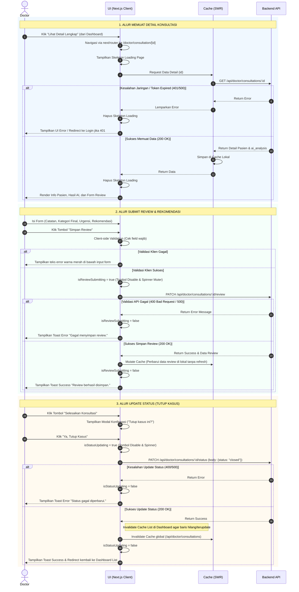

```mermaid
sequenceDiagram
    autonumber
    actor D as Doctor
    participant UI as UI (Next.js Client)
    participant C as Cache (SWR)
    participant API as Backend API

    %% --- MEMUAT HALAMAN DETAIL ---
    rect rgb(240, 248, 255)
    Note over D, API: 1. ALUR MEMUAT DETAIL KONSULTASI
    D->>UI: Klik "Lihat Detail Lengkap" (dari Dashboard)
    UI->>UI: Navigasi via next/router ke /doctor/consultation/[id]
    UI->>UI: Tampilkan Skeleton Loading Page
    
    UI->>C: Request Data Detail (id)
    C->>API: GET /api/doctor/consultations/:id
    
    alt Kesalahan Jaringan / Token Expired (401/500)
        API-->>C: Return Error
        C-->>UI: Lemparkan Error
        UI->>UI: Hapus Skeleton Loading
        UI-->>D: Tampilkan UI Error / Redirect ke Login jika 401
    else Sukses Memuat Data (200 OK)
        API-->>C: Return Detail Pasien & ai_analysis
        C->>C: Simpan di Cache Lokal
        C-->>UI: Return Data
        UI->>UI: Hapus Skeleton Loading
        UI-->>D: Render Info Pasien, Hasil AI, dan Form Review
    end
    end

    %% --- SUBMIT REVIEW ---
    rect rgb(245, 255, 250)
    Note over D, API: 2. ALUR SUBMIT REVIEW & REKOMENDASI
    D->>UI: Isi Form (Catatan, Kategori Final, Urgensi, Rekomendasi)
    D->>UI: Klik Tombol "Simpan Review"
    
    UI->>UI: Client-side Validation (Cek field wajib)
    
    alt Validasi Klien Gagal
        UI-->>D: Tampilkan teks error warna merah di bawah input form
    else Validasi Klien Sukses
        UI->>UI: isReviewSubmitting = true (Tombol Disable & Spinner Muter)
        UI->>API: PATCH /api/doctor/consultations/:id/review
        
        alt Validasi API Gagal (400 Bad Request / 500)
            API-->>UI: Return Error Message
            UI->>UI: isReviewSubmitting = false
            UI-->>D: Tampilkan Toast Error "Gagal menyimpan review."
        else Sukses Simpan Review (200 OK)
            API-->>UI: Return Success & Data Review
            UI->>C: Mutate Cache (Perbarui data review di lokal tanpa refresh)
            UI->>UI: isReviewSubmitting = false
            UI-->>D: Tampilkan Toast Success "Review berhasil disimpan."
        end
    end
    end

    %% --- UPDATE STATUS ---
    rect rgb(255, 250, 240)
    Note over D, API: 3. ALUR UPDATE STATUS (TUTUP KASUS)
    D->>UI: Klik Tombol "Selesaikan Konsultasi"
    UI->>UI: Tampilkan Modal Konfirmasi ("Tutup kasus ini?")
    D->>UI: Klik "Ya, Tutup Kasus"
    
    UI->>UI: isStatusUpdating = true (Tombol Disable & Spinner)
    UI->>API: PATCH /api/doctor/consultations/:id/status (body: {status: "closed"})
    
    alt Kesalahan Update Status (400/500)
        API-->>UI: Return Error
        UI->>UI: isStatusUpdating = false
        UI-->>D: Tampilkan Toast Error "Status gagal diperbarui."
    else Sukses Update Status (200 OK)
        API-->>UI: Return Success
        
        Note right of UI: Invalidate Cache List di Dashboard agar baris hilang/terupdate
        UI->>C: Invalidate Cache global (/api/doctor/consultations)
        
        UI->>UI: isStatusUpdating = false
        UI-->>D: Tampilkan Toast Success & Redirect kembali ke Dashboard List
    end
    end
```